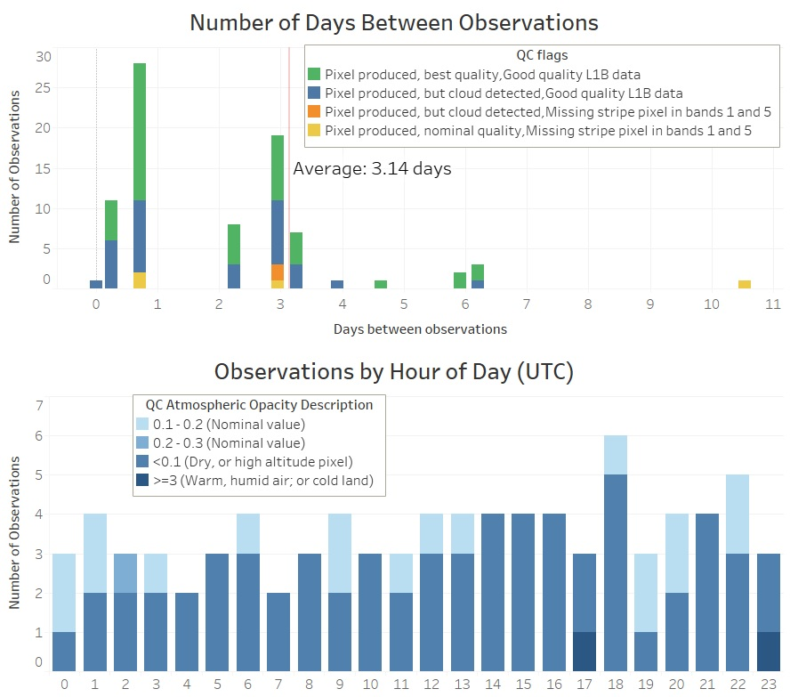

# ecostress-utils

My notes, tips, and tricks for using ECOSTRESS imagery.

## My scripts for managing NASA JPL ECOSTRESS files

* **download-ecostress.sh**: download h5 files after staging through Earthdata
* **datelist.sh**: get a list of observations date/times from ECOSTRESS filenames
* [**ECOSTRESS_swath2grid.py**](https://github.com/spestana/ECOSTRESS_swath2grid): Also see this (2019) version of the swath2grid script to which I've added different resampling options ([to get the latest offical version here](https://git.earthdata.nasa.gov/projects/LPDUR/repos/ecostress_swath2grid/browse))

## Notes on predicting ECOSTRESS overpass timing

I have had to plan two different fieldwork activities to coincide with ECOSTRESS images. These are some notes about how I went about planning those.

Official documentation says that ECOSTRESS should be able to image any given point on Earth's land surface (within +/- 51 degrees latitude, limited by the orbital inclination of ISS) every 3 to 4 days. I wanted to look at the actual observation data and see if this was true, and see what the typical revisit time was for a study site in California. I used [earthdata.nasa.gov](https://earthdata.nasa.gov/) to find all prior overpasses of this site, then looked at the distribution of those to find an average revisit interval. I was also interested in seeing how frequent ECOSTRESS made an observation at a specific time of day. The image below is for several months of ECOSTRESS observations over one of our study sites in California in 2020.

*Observations timing stats*

This top plot shows an average of about 3 days between ECOSTRESS observations at this site from this time period. Note that there are also a lot of days with 2 or more observations. This is really neat - the ability to, for example, within 24 hours get a 70 m spatial resolution thermal infrared image of a site of interest at night and then again during the daytime. The lower plot shows that for this site within this time period, there was no real bias in observations at a specific time of day (nearly equal number of observations across all hours of the day). Colors in both plots relate to quality control (QC) flags including when cloud cover was detecting (blocking the view of the study site). To make these plots, I used the [datelist.sh](datelist.sh) script to read the dates from the filenames of ECOSTRESS images I'd downloaded from Earthdata.

Based on the above information, I could confirm that ECOSTRESS was indeed passing over about once every 3 to 4 days, and there was no bias towards any hour of day. This meant that for planning fieldwork, if I plan about a week of activity it is likely that we should get at least one ECOSTRESS image of our study site. But when exactly is that going to occur?

The ISS orbit does change a bit from time to time (due to stationkeeping and recieving visiting spacecraft), but we can use some basic orbit prediciton tools and the ISS current TLE (two line element) to estimate when it might pass overhead. Websites like [heavens-above.com](https://heavens-above.com/PassSummary.aspx?satid=25544&lat=35.8171&lng=-106.3037&loc=SUMO&alt=0&tz=MST) make this easy (just make sure in your search to set "Passes to include" to "all" since we are not just looking for the few instances where we can see the ISS at night). Given the field of view of ECOSTRESS, I estimated that any overpass greater than 60 degrees above the horizon would put our site in its field of view. 

*Example table from heavens-above.com*

When I was trying to predict overpasses about one month in advance, the actual overpass times ended up being within +/-15 minutes of those earlier predictions. This was not bad for planning our fieldwork where we only needed to pick which day we wanted to be in the field. More importantly though, I found that the predicted ISS elevation angle (angle above the horizon) changed as much as 20 degrees between those earlier precitions from one month in advance and the actual overpass. This prediction uncertainty led to one of our predicted overpasses missing our field site - our field site ended up just outside the field of view of ECOSTRESS, just barely past the image boundary.
